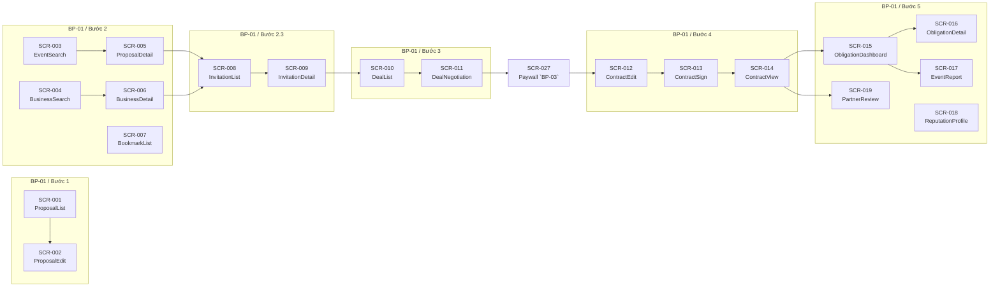

# Screens Mapping — UniLink Platform

> Bảng ánh xạ tổng hợp toàn bộ màn hình hệ thống, theo quy trình nghiệp vụ BP-01 (Quy trình hợp tác tài trợ sự kiện giữa BTC sinh viên và doanh nghiệp).

---

## Tổng quan

| Thống kê | Giá trị |
|----------|---------|
| Tổng số screens | **19** (5 screens cập nhật bởi BP-03) |
| Tổng số use cases | **33** (2 removed bởi BP-03: UC-24, UC-33) |
| Quy trình nghiệp vụ | BP-01 — Quy trình hợp tác tài trợ sự kiện |
| Số bước quy trình | 5 bước chính |

---

## Bảng ánh xạ Screen ↔ Use Case ↔ Quy trình nghiệp vụ

| Screen ID | Screen Name | Screen User | BP Code | Bước QT | Giai đoạn | UC liên quan | Ghi chú |
|-----------|-------------|-------------|---------|---------|-----------|-------------|---------|
| SCR-001 | Organizer_ProposalList_Screen | Organizer | BP-01 | Bước 1 | Tạo hồ sơ tài trợ sự kiện | UC-01, UC-04, UC-05 | Dashboard quản lý hồ sơ |
| SCR-002 | Organizer_ProposalEdit_Screen | Organizer | BP-01 | Bước 1 | Tạo hồ sơ tài trợ sự kiện | UC-02, UC-03, UC-04, UC-05 | Hub soạn thảo: nội dung + gói tài trợ + publish |
| SCR-003 | Sponsor_EventSearch_Screen | Sponsor | BP-01 | Bước 2 | Tìm kiếm và tiếp cận đối tác (2.1) | UC-06, UC-32 | Bao gồm tab "Gợi ý" (UC-32) |
| SCR-004 | Organizer_BusinessSearch_Screen | Organizer | BP-01 | Bước 2 | Tìm kiếm và tiếp cận đối tác (2.2) | UC-07, UC-32 | Bao gồm tab "Gợi ý" (UC-32) |
| SCR-005 | Sponsor_ProposalDetail_Screen | Sponsor | BP-01 | Bước 2 | Tìm kiếm và tiếp cận đối tác | UC-08, UC-10, UC-11 | Xem chi tiết + bookmark + gửi lời mời (modal) |
| SCR-006 | Organizer_BusinessDetail_Screen | Organizer | BP-01 | Bước 2 | Tìm kiếm và tiếp cận đối tác | UC-09, UC-10, UC-11 | Xem chi tiết + bookmark + gửi lời mời (modal) |
| SCR-007 | User_BookmarkList_Screen | Authenticated User | BP-01 | Bước 2 | Tìm kiếm và tiếp cận đối tác | UC-10 | Danh sách hồ sơ đã lưu |
| SCR-008 | User_InvitationList_Screen | Authenticated User | BP-01 | Bước 2.3 | Gửi lời mời tài trợ | UC-13 | Theo dõi lời mời gửi/nhận |
| SCR-009 | User_InvitationDetail_Screen | Authenticated User | BP-01 | Bước 2.3 | Gửi lời mời tài trợ | UC-12, UC-13 | Chi tiết + accept/decline |
| SCR-010 | User_DealList_Screen | Authenticated User | BP-01 | Bước 3 | Thương thảo hợp đồng tài trợ | UC-14 | Dashboard thương vụ |
| SCR-011 | User_DealNegotiation_Screen | Authenticated User | BP-01 | Bước 3 | Thương thảo hợp đồng tài trợ | UC-14, UC-15, UC-16, UC-17, UC-18, UC-19, UC-51, UC-56 | Hub thương thảo: chat + meeting + agreement + draft agreement `[UPDATED — BP03]` |
| SCR-012 | User_ContractEdit_Screen | Authenticated User | BP-01 | Bước 4 | Soạn thảo và ký kết hợp đồng | UC-20, UC-21 | Soạn thảo + xác nhận `[UPDATED — BP03: nav source]` |
| SCR-013 | User_ContractSign_Screen | Authenticated User | BP-01 | Bước 4 | Soạn thảo và ký kết hợp đồng | UC-22, UC-49 | Ký chữ ký điện tử + 72h countdown `[UPDATED — BP03]` |
| SCR-014 | User_ContractView_Screen | Authenticated User | BP-01 | Bước 4 | Soạn thảo và ký kết hợp đồng | UC-23 | Xem HĐ đã ký + xuất PDF `[UPDATED — BP03: -UC-24]` |
| SCR-015 | User_ObligationDashboard_Screen | Authenticated User | BP-01 | Bước 5 | Thực hiện nghĩa vụ tài trợ | UC-25 | Dashboard tiến trình nghĩa vụ |
| SCR-016 | User_ObligationDetail_Screen | Authenticated User | BP-01 | Bước 5 | Thực hiện nghĩa vụ tài trợ | UC-25, UC-26, UC-27 | Chi tiết + nộp bằng chứng + xác nhận |
| SCR-017 | Organizer_EventReport_Screen | Organizer | BP-01 | Bước 5 | Thực hiện nghĩa vụ tài trợ | UC-28 | Nộp báo cáo kết quả sự kiện |
| SCR-018 | User_ReputationProfile_Screen | Authenticated User | BP-01 | Bước 5 | Thực hiện nghĩa vụ tài trợ (đánh giá) | UC-30, UC-31 | Xem uy tín + báo cáo vi phạm |
| SCR-019 | User_PartnerReview_Screen | Authenticated User | BP-01 | Bước 5 | Thực hiện nghĩa vụ tài trợ (đánh giá) | UC-29 | Form đánh giá đối tác |

---

## Ánh xạ UC → Screen (traceability ngược)

Bảng dưới đây cho phép tra cứu bất kỳ UC nào và xác định nhanh nó được xử lý tại screen nào, dưới hình thức gì.

| UC ID | UC Name | Screen(s) xử lý | Hình thức xử lý |
|-------|---------|-----------------|-----------------|
| UC-01 | Tạo hồ sơ tài trợ | SCR-001 | Action: CTA "Tạo mới" → redirect SCR-002 |
| UC-02 | Chỉnh sửa nội dung hồ sơ | SCR-002 | Screen chính (tab/section nội dung) |
| UC-03 | Quản lý gói tài trợ | SCR-002 | Tab/section trong screen soạn thảo |
| UC-04 | Phát hành hồ sơ | SCR-001, SCR-002 | Action trên SCR-002 + status update SCR-001 |
| UC-05 | Hủy phát hành hồ sơ | SCR-001, SCR-002 | Action trên SCR-002 + confirm dialog |
| UC-06 | Tìm kiếm sự kiện | SCR-003 | Screen chính (tab "Tìm kiếm") |
| UC-07 | Tìm kiếm doanh nghiệp | SCR-004 | Screen chính (tab "Tìm kiếm") |
| UC-08 | Xem chi tiết hồ sơ tài trợ | SCR-005 | Screen chính |
| UC-09 | Xem chi tiết doanh nghiệp | SCR-006 | Screen chính |
| UC-10 | Bookmark hồ sơ | SCR-005, SCR-006, SCR-007 | Action (toggle) trên SCR-005/006 + list trên SCR-007 |
| UC-11 | Gửi lời mời tài trợ | SCR-005, SCR-006 | Modal trên screen chi tiết (CTA → form modal) |
| UC-12 | Phản hồi lời mời | SCR-009 | Screen chính (Accept/Decline) |
| UC-13 | Theo dõi lời mời | SCR-008, SCR-009 | List (SCR-008) + Detail (SCR-009) |
| UC-14 | Trao đổi tin nhắn | SCR-010, SCR-011 | Entry via SCR-010 → Chat panel trên SCR-011. `[UPDATED — BP03]` +Data Masking, +anti-bypass |
| UC-15 | Đặt lịch họp | SCR-011 | Component: meeting form trên screen thương thảo |
| UC-16 | Phản hồi lịch họp | SCR-011 | Action: accept/decline/reschedule trên meeting card |
| UC-17 | Ghi nhận kết quả cuộc họp | SCR-011 | Component: notebook trên meeting card |
| UC-18 | Xác nhận đồng thuận | SCR-011 | Action: CTA "Xác nhận đồng thuận". `[UPDATED — BP03]` +gate DraftAgreement, +miễn trừ, +redirect SCR-027 |
| UC-19 | Hủy bỏ thương thảo | SCR-011 | Action: CTA + confirm dialog |
| UC-51 | Xem trước chi phí dịch vụ | SCR-011 | Modal: fee preview trên screen thương thảo `[ADDED — BP03]` |
| UC-56 | Tạo thỏa thuận nháp | SCR-011 | Component: form + card trên screen thương thảo `[ADDED — BP03]` |
| UC-20 | Chỉnh sửa hợp đồng | SCR-012 | Screen chính (form chỉnh sửa) |
| UC-21 | Xác nhận nội dung hợp đồng | SCR-012 | Action: CTA "Xác nhận nội dung" |
| UC-22 | Ký hợp đồng điện tử | SCR-013 | Screen chính (signature pad + 72h countdown `[UPDATED — BP03]`) |
| UC-23 | Xuất hợp đồng PDF | SCR-014 | Action: nút "Xuất PDF" |
| ~~UC-24~~ | ~~Yêu cầu hóa đơn VAT~~ | ~~SCR-014~~ | ~~REMOVED — BP03: nền tảng chỉ xuất VAT cho phí dịch vụ (SF-12)~~ |
| ~~UC-33~~ | ~~Hủy đồng thuận ký kết~~ | ~~—~~ | ~~DEPRECATED — BP03: hard-lock sau 2/2 thanh toán~~ |
| UC-49 | Xử lý vi phạm ký kết | SCR-013, SCR-027 | Breach trigger trên SCR-013, report form trên SCR-027 `[ADDED — BP03]` |
| UC-25 | Theo dõi nghĩa vụ | SCR-015, SCR-016 | Dashboard (SCR-015) + Detail (SCR-016) |
| UC-26 | Nộp bằng chứng hoàn thành | SCR-016 | Component: evidence form trên obligation detail |
| UC-27 | Xác nhận hoàn thành | SCR-016 | Action: confirm/dispute trên obligation detail |
| UC-28 | Nộp báo cáo kết quả sự kiện | SCR-017 | Screen chính (form báo cáo) |
| UC-29 | Gửi đánh giá đối tác | SCR-019 | Screen chính (form đánh giá) |
| UC-30 | Xem điểm uy tín | SCR-018 | Screen chính (reputation display) |
| UC-31 | Báo cáo đánh giá vi phạm | SCR-018 | Modal: form báo cáo trên screen uy tín |
| UC-32 | Xem gợi ý tự động | SCR-003, SCR-004 | Tab "Gợi ý cho bạn" trên trang tìm kiếm |
| UC-33 | Hủy đồng thuận ký kết | REMOVED | ~~Action removed by hard-lock policy~~ `[DEPRECATED — BP03]` |

---

## Phân bổ Screen theo giai đoạn quy trình

---

## Phân bổ Screen theo vai trò người dùng

| Vai trò | Số screen chuyên dụng | Screen IDs |
|---------|----------------------|------------|
| **Organizer** (chuyên dụng) | 4 | SCR-001, SCR-002, SCR-004, SCR-017 |
| **Sponsor** (chuyên dụng) | 2 | SCR-003, SCR-005 |
| **Authenticated User** (dùng chung) | 13 | SCR-006⁰, SCR-007, SCR-008, SCR-009, SCR-010, SCR-011, SCR-012, SCR-013, SCR-014, SCR-015, SCR-016, SCR-018, SCR-019 |

> ⁰ SCR-006 thuộc Organizer nhưng chia sẻ pattern với SCR-005 (Sponsor)

---

## Quyết định thiết kế chính (Design Decisions)

| # | Quyết định | UC liên quan | Lý do |
|---|-----------|-------------|-------|
| D1 | UC-03 (Gói tài trợ) gộp vào SCR-002 | UC-02, UC-03 | Cùng mục tiêu soạn thảo, gói tài trợ là tab/section |
| D2 | UC-04/UC-05 (Publish/Unpublish) là action trên SCR-002 | UC-04, UC-05 | Không phải screen riêng — CTA + confirm dialog |
| D3 | UC-11 (Gửi lời mời) là modal trên SCR-005/006 | UC-11 | Form đơn giản, trigger từ CTA trên detail view |
| D4 | UC-32 (Gợi ý) gộp thành tab trong SCR-003/004 | UC-32 | Tab "Gợi ý" trong trang tìm kiếm theo vai trò |
| D5 | 8 UC gộp vào SCR-011 (Deal Negotiation) | UC-14~19, UC-51, UC-56 | Hub thương thảo — cùng deal context, không có navigation boundary thực sự. `[UPDATED — BP03: +UC-51, +UC-56]` |
| D6 | UC-33 (Hủy đồng thuận) deprecated | UC-33 | Hard-lock removes cancel action from contract screen `[UPDATED — BP03]` |
| D7 | UC-31 (Báo cáo vi phạm) là modal trên SCR-018 | UC-31 | Form đơn giản, trigger từ nút trên đánh giá |
| D8 | UC-23 (Xuất PDF) là action trên SCR-014 | UC-23 | Nút download, không cần screen riêng |
| D9 | UC-24 (VAT) loại bỏ khỏi SCR-014 | UC-24 | `[UPDATED — BP03]` Nền tảng chỉ xuất VAT cho phí dịch vụ, không cho giá trị tài trợ |

---

## Ghi chú mở rộng

- **BP Code format**: `BP-XX` — dùng để phân biệt khi hệ thống bổ sung thêm quy trình nghiệp vụ mới (VD: BP-02, BP-03)
- **Bước QT format**: `Bước X` hoặc `Bước X.Y` — tham chiếu trực tiếp đến số mục trong tài liệu quy trình nghiệp vụ
- **Screen ID format**: `SCR-XXX` — số tuần tự, BP-01 sử dụng SCR-001 đến SCR-019
- **[UPDATED — BP03]**: 5 screens của BP-01 đã được cập nhật (SCR-010, SCR-011, SCR-012, SCR-013, SCR-014). Xem chi tiết tại `BP03_screens.md`
- **[REMOVED — BP03]**: UC-24, UC-33 đã bị loại bỏ/deprecated
- Luồng mới: SCR-011 → SCR-027 (Paywall) → SCR-012 (thay vì SCR-011 → SCR-012 trực tiếp)
