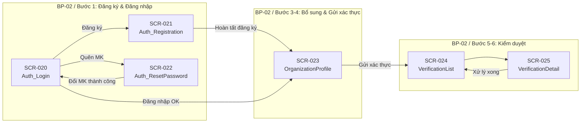

# Screens Mapping — BP-02: Quy trình đăng ký và xác thực tài khoản

> Bảng ánh xạ tổng hợp các màn hình cho quy trình nghiệp vụ BP-02 (Đăng ký tài khoản, bổ sung hồ sơ tổ chức, và kiểm duyệt xác thực).

---

## Tổng quan

| Thống kê | Giá trị |
|----------|---------|
| Tổng số screens | **6** |
| Tổng số use cases | **12** (UC-34 → UC-45) |
| Quy trình nghiệp vụ | BP-02 — Đăng ký và xác thực tài khoản |
| Số bước quy trình | 8 bước chính |
| System Features | SF-08, SF-09, SF-10 |

---

## Bảng ánh xạ Screen ↔ Use Case ↔ Quy trình nghiệp vụ

| Screen ID | Screen Name | Screen User | BP Code | Bước QT | Giai đoạn | UC liên quan | Ghi chú |
|-----------|-------------|-------------|---------|---------|-----------|-------------|---------|
| SCR-020 | Auth_Login_Screen | Guest | BP-02 | Bước 1 | Đăng nhập hệ thống | UC-36, UC-37 (trigger) | Đăng nhập email/Google + link quên MK |
| SCR-021 | Auth_Registration_Screen | Guest | BP-02 | Bước 1–2 | Đăng ký tài khoản | UC-34, UC-35 | Multi-step wizard: credentials → role → org info |
| SCR-022 | Auth_ResetPassword_Screen | Guest | BP-02 | Bước 1 | Khôi phục truy cập | UC-37 | 2 giai đoạn: yêu cầu email + nhập MK mới |
| SCR-023 | User_OrganizationProfile_Screen | Authenticated User | BP-02 | Bước 3–4 | Bổ sung hồ sơ & gửi xác thực | UC-38, UC-39, UC-40 | Hub quản lý hồ sơ: xem, sửa, upload, gửi |
| SCR-024 | Admin_VerificationList_Screen | Admin | BP-02 | Bước 5 | Kiểm duyệt hồ sơ | UC-41 | Dashboard danh sách chờ duyệt |
| SCR-025 | Admin_VerificationDetail_Screen | Admin | BP-02 | Bước 5–6 | Kiểm duyệt & ra quyết định | UC-42, UC-43, UC-44, UC-45 | Chi tiết + phê duyệt/từ chối/yêu cầu bổ sung |

---

## Ánh xạ UC → Screen (traceability ngược)

| UC ID | UC Name | Screen(s) xử lý | Hình thức xử lý |
|-------|---------|-----------------|-----------------|
| UC-34 | Đăng ký tài khoản bằng email | SCR-021 | Screen chính (multi-step form: email/MK → role → org info) |
| UC-35 | Đăng ký tài khoản bằng Google | SCR-021 | Screen chính (Google OAuth → role → org info) |
| UC-36 | Đăng nhập hệ thống | SCR-020 | Screen chính (form email/MK + Google OAuth button) |
| UC-37 | Đặt lại mật khẩu | SCR-020 (trigger), SCR-022 | Link "Quên MK" trên SCR-020 → SCR-022 xử lý quy trình |
| UC-38 | Bổ sung thông tin và tài liệu | SCR-023 | Action: "Bổ sung thông tin" → edit mode + upload area |
| UC-39 | Chỉnh sửa hồ sơ tổ chức | SCR-023 | Action: "Chỉnh sửa" → edit mode (quyền phụ thuộc trạng thái) |
| UC-40 | Gửi hồ sơ xác thực | SCR-023 | Action: CTA "Gửi hồ sơ xác thực" trên cùng screen |
| UC-41 | Xem danh sách chờ kiểm duyệt | SCR-024 | Screen chính (data table + filter + search + pagination) |
| UC-42 | Xem chi tiết hồ sơ xác thực | SCR-025 | Screen chính (org info + tài liệu + lịch sử) |
| UC-43 | Phê duyệt hồ sơ | SCR-025 | Modal: confirm dialog + ghi chú tùy chọn |
| UC-44 | Từ chối hồ sơ | SCR-025 | Modal: form từ chối (lý do bắt buộc) |
| UC-45 | Yêu cầu bổ sung thông tin | SCR-025 | Modal: form yêu cầu (chi tiết bắt buộc) |

---

## Phân bổ Screen theo giai đoạn quy trình

---

## Phân bổ Screen theo vai trò người dùng

| Vai trò | Số screen | Screen IDs |
|---------|----------|------------|
| **Guest** (chưa đăng nhập) | 3 | SCR-020, SCR-021, SCR-022 |
| **Authenticated User** (dùng chung) | 1 | SCR-023 |
| **Admin** (kiểm duyệt) | 2 | SCR-024, SCR-025 |

---

## Quyết định thiết kế chính (Design Decisions)

| # | Quyết định | UC liên quan | Lý do |
|---|-----------|-------------|-------|
| D10 | UC-34 + UC-35 gộp vào SCR-021 (Registration) | UC-34, UC-35 | Cùng mục tiêu "tạo tài khoản", Google OAuth chỉ thay step 1 |
| D11 | Registration là multi-step wizard, KHÔNG phải 3 screens | UC-34, UC-35 | Cùng phiên, cùng goal, không có back-navigation có ý nghĩa |
| D12 | UC-37 tách thành SCR-022 (Reset Password) | UC-37 | Context khác biệt với login, route riêng, 2 giai đoạn có entry point khác nhau |
| D13 | UC-38 + UC-39 + UC-40 gộp vào SCR-023 | UC-38, UC-39, UC-40 | Cùng data scope (hồ sơ tổ chức), cùng context, thường thực hiện liên tiếp |
| D14 | UC-43/UC-44/UC-45 là modals trên SCR-025 | UC-43, UC-44, UC-45 | Mỗi action là form đơn giản/confirm dialog, không cần screen riêng |
| D15 | List → Detail pattern cho Admin verification | UC-41, UC-42 | Pattern chuẩn list-detail, context switch rõ ràng |

---

## Tích hợp với BP-01

Screens của BP-02 là **điều kiện tiên quyết** cho BP-01:

- Guest phải đăng ký (SCR-021) → đăng nhập (SCR-020) → bổ sung hồ sơ (SCR-023) → được xác thực (SCR-024/025) trước khi truy cập các chức năng của BP-01.
- Sau khi VERIFIED, Authenticated User được mở khóa quyền truy cập tất cả screens BP-01 (SCR-001 đến SCR-019).

---

## Ghi chú mở rộng

- **Screen ID format**: Tiếp tục từ SCR-020 (sau 19 screens của BP-01)
- **Bước QT format**: Tham chiếu đến tài liệu quy trình BP-02 gốc
- Screens BP-02 phục vụ 3 nhóm actor rõ ràng: Guest (auth), Authenticated User (profile), Admin (moderation)
- Tất cả 12 UC (UC-34 đến UC-45) đã được cover đầy đủ trong 6 screens
