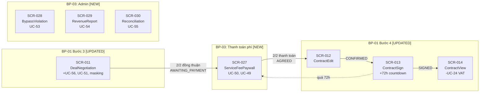

# Screens Mapping — BP-03: Quy trình thanh toán phí dịch vụ

> Bảng ánh xạ tổng hợp các màn hình cho quy trình nghiệp vụ BP-03 (Thanh toán phí dịch vụ kết nối, Data Masking, và Quản trị rủi ro thanh toán).

---

## Tổng quan

| Thống kê | Giá trị |
|----------|---------|
| Tổng số screens mới | **4** |
| Tổng số screens cập nhật (từ BP-01) | **5** |
| Tổng số use cases | **14** (9 mới + 5 sửa đổi) |
| Quy trình nghiệp vụ | BP-03 — Thanh toán phí dịch vụ kết nối |
| System Features | SF-12, SF-13, SF-14, SF-04 (updated), SF-05 (updated) |

---

## Bảng ánh xạ Screen ↔ Use Case ↔ Quy trình nghiệp vụ

### Screens MỚI

| Screen ID | Screen Name | Screen User | BP Code | Giai đoạn | UC liên quan | Ghi chú |
|-----------|-------------|-------------|---------|-----------|-------------|---------|
| SCR-027 | User_ServiceFeePaywall_Screen | Authenticated User | BP-03 | Thanh toán phí dịch vụ | UC-50, UC-49 | Paywall QR + countdown 48h + breach report |
| SCR-028 | Admin_BypassViolationList_Screen | Admin | BP-03 | Quản trị Data Masking | UC-53 | Master-detail: review vi phạm lách bộ lọc |
| SCR-029 | Admin_PlatformRevenueReport_Screen | Admin | BP-03 | Quản trị doanh thu | UC-54 | KPI dashboard + danh sách giao dịch |
| SCR-030 | Admin_PaymentReconciliation_Screen | Admin | BP-03 | Đối soát thanh toán | UC-55 | Master-detail: đối soát MISMATCH/UNMATCHED |

### Screens CẬP NHẬT (từ BP-01)

| Screen ID | Screen Name | Thay đổi chính | UC ảnh hưởng |
|-----------|-------------|----------------|-------------|
| SCR-010 | User_DealList_Screen | Thêm AWAITING_PAYMENT status + payment badge + route → SCR-027 | UC-50 |
| SCR-011 | User_DealNegotiation_Screen | **Major:** +DraftAgreement form, +Data Masking, +anti-bypass, +fee preview modal, +disclaimer, +AWAITING_PAYMENT | UC-14, UC-18, UC-51, UC-56 |
| SCR-012 | User_ContractEdit_Screen | Navigation In từ SCR-027, BR-0501 trigger update | UC-20, UC-21 |
| SCR-013 | User_ContractSign_Screen | +72h countdown timer, +breach trigger, +BR-0510 | UC-22, UC-49 |
| SCR-014 | User_ContractView_Screen | **Loại bỏ UC-24** (VAT modal + input fields + states) | UC-23 |

---

## Ánh xạ UC → Screen (traceability ngược)

### Use Cases MỚI

| UC ID | UC Name | Screen(s) xử lý | Hình thức xử lý |
|-------|---------|-----------------|-----------------|
| UC-49 | Xử lý vi phạm ký kết | SCR-027, SCR-013 | Form report trên SCR-027 + grace period UI trên SCR-013 |
| UC-50 | Thanh toán phí dịch vụ | SCR-027 | Screen chính (Paywall QR + countdown + payment tracker) |
| UC-51 | Xem trước chi phí | SCR-011 | Modal: fee preview, trigger từ CTA trên DraftAgreement context |
| UC-52 | Xuất VAT phí dịch vụ | — (automated) | Không có screen — System tự động tạo hóa đơn sau 2/2 |
| UC-53 | Xem xét vi phạm lách bộ lọc | SCR-028 | Screen chính (master-detail: list + review panel) |
| UC-54 | Xem báo cáo doanh thu | SCR-029 | Screen chính (KPI cards + data table + filters) |
| UC-55 | Đối soát thanh toán thủ công | SCR-030 | Screen chính (master-detail: list + reconciliation panel) |
| UC-56 | Tạo thỏa thuận nháp | SCR-011 | Component: form + card trong screen thương thảo |

### Use Cases SỬA ĐỔI

| UC ID | UC Name | Screen(s) ảnh hưởng | Thay đổi |
|-------|---------|---------------------|---------|
| UC-14 | Trao đổi tin nhắn | SCR-011 | +Data Masking display, +anti-bypass EF-14.4, +AWAITING_PAYMENT status |
| UC-18 | Xác nhận đồng thuận | SCR-011 | +Gate DraftAgreement, +miễn trừ hiện vật, +tính phí, +redirect SCR-027 |
| UC-20 | Chỉnh sửa hợp đồng | SCR-012 | Minor: navigation source update |
| UC-21 | Xác nhận nội dung HĐ | SCR-012 | Minor: reference update |
| UC-22 | Ký hợp đồng điện tử | SCR-013 | +72h countdown, +breach trigger, +BR-0510 |

### Use Cases LOẠI BỎ

| UC ID | UC Name | Screen ảnh hưởng | Thay đổi |
|-------|---------|-----------------|---------|
| ~~UC-24~~ | ~~Yêu cầu hóa đơn VAT~~ | SCR-014 | Modal + inputs + states + CTA bị loại bỏ hoàn toàn |
| ~~UC-33~~ | ~~Hủy đồng thuận ký kết~~ | — | Deprecated — thay thế bởi hard-lock (SF-05 FR-0507) |

---

## Phân bổ Screen theo giai đoạn quy trình



---

## Phân bổ Screen theo vai trò người dùng

| Vai trò | Screens mới | Screens cập nhật | Tổng ảnh hưởng |
|---------|-------------|-----------------|---------------|
| **Authenticated User** | SCR-027 | SCR-010, SCR-011, SCR-012, SCR-013, SCR-014 | 6 |
| **Admin** | SCR-028, SCR-029, SCR-030 | — | 3 |

---

## Quyết định thiết kế chính (Design Decisions)

| # | Quyết định | UC liên quan | Lý do |
|---|-----------|-------------|-------|
| D16 | UC-50 tạo screen riêng SCR-027 (Paywall) | UC-50 | Transaction boundary rõ — data scope (QR, fee, countdown), goal (thanh toán), lifecycle (48h) khác hoàn toàn |
| D17 | UC-56 (Draft Agreement) gộp vào SCR-011 | UC-56 | Cùng deal context, cùng phiên thương thảo, pattern tương tự meeting form |
| D18 | UC-51 (Fee Preview) là modal trên SCR-011 | UC-51 | Read-only, form nhập đơn giản, không thay đổi dữ liệu — không cần screen riêng |
| D19 | UC-52 (VAT Invoice) không có screen | UC-52 | Fully automated — system event trigger, không có actor interaction |
| D20 | UC-49 (Breach) là form trên SCR-027 | UC-49 | Trigger sau 72h deadline — cùng Paywall context, form report đơn giản |
| D21 | UC-53 gộp list + detail (master-detail) | UC-53 | Volume thấp, data scope nhỏ — tương tự pattern SCR-025 Admin Verification |
| D22 | 3 Admin screens tách riêng | UC-53, UC-54, UC-55 | 3 goals hoàn toàn khác: violation mgmt, reporting, reconciliation |
| D23 | UC-24 loại bỏ khỏi SCR-014 | UC-24 | Business rule thay đổi — nền tảng CHỈ xuất VAT cho phí dịch vụ (SF-12) |
| D24 | UC-33 deprecated — không còn action nào | UC-33 | Hard-lock policy sau 2/2 thanh toán |

---

## Luồng dữ liệu mới (End-to-End Flow)

```
SCR-011 (Thương thảo)
  ├── UC-56: Tạo thỏa thuận nháp
  ├── UC-51: Xem trước phí dịch vụ (modal)
  ├── UC-14: Nhắn tin (+ Data Masking)
  └── UC-18: Đồng thuận → AWAITING_PAYMENT
        │
        ▼
SCR-027 (Paywall — 48h countdown)
  ├── UC-50: Thanh toán phí (QR)
  ├── UC-49: Tố cáo vi phạm (nếu quá 72h ký)
  └── 2/2 thanh toán → AGREED
        │
        ▼
SCR-012 (Soạn HĐ) → SCR-013 (Ký HĐ — 72h countdown)
        │                      │
        │                      ├── SIGNED → SCR-014 (Xem HĐ)
        │                      └── Quá 72h → SCR-027 (Tố cáo)
        │
SCR-028 (Admin: Vi phạm masking)
SCR-029 (Admin: Doanh thu)
SCR-030 (Admin: Đối soát)
```

---

## Tích hợp với BP-01 và BP-02

- **BP-02** → **BP-01**: User phải đăng ký + xác thực trước khi truy cập chức năng BP-01
- **BP-01** → **BP-03**: Sau bước thương thảo (SCR-011), luồng giờ đi qua **Paywall (SCR-027)** trước khi tiến đến soạn thảo hợp đồng
- **BP-03 Screens** xen giữa BP-01 Bước 3 và Bước 4, tạo thành **gate** bắt buộc

---

## Ghi chú mở rộng

- **Screen ID format**: Tiếp tục từ SCR-027 (sau 26 screens của BP-01 + BP-02)
- **Bước QT format**: Tham chiếu đến tài liệu quy trình BP-03 gốc
- 4 screens mới phục vụ 2 nhóm actor: Authenticated User (1 screen Paywall) và Admin (3 screens quản trị)
- 5 screens BP-01 cập nhật phản ánh integration point giữa BP-01 và BP-03
- UC-52 (VAT invoice tự động) không có screen — system event, delivered via email
- Tổng hệ thống sau BP-03: **30 screens** (19 BP-01 + 6 BP-02 + 4 BP-03 + 1 BP-01/BP-03 shared = SCR-026 public profile không đổi)
