# Danh sách Use Case — UniLink Platform

## Tổng quan

Tài liệu này liệt kê toàn bộ use case của hệ thống UniLink, được phân tích từ 7 System Features
(SF-01 đến SF-07). Mỗi use case đại diện cho **một mục tiêu cụ thể** của một actor trong một phiên
làm việc duy nhất.

---

## Actor Model

### Abstract Actor

| Actor | Mô tả |
|-------|--------|
| **Authenticated User** | Actor trừu tượng — đại diện cho bất kỳ người dùng đã xác thực trên hệ thống. Là generalization của Organizer và Sponsor. |

### Concrete Actors

| Actor | System Role | Kế thừa từ | Mô tả |
|-------|-------------|------------|--------|
| **Organizer (BTC)** | `organizer` | Authenticated User | Ban tổ chức — Câu lạc bộ, đội nhóm sinh viên tổ chức sự kiện |
| **Sponsor (Doanh nghiệp)** | `sponsor` | Authenticated User | Doanh nghiệp — Nhà tài trợ tiềm năng hoặc đã ký kết |
| **System** | `system` | — | Hệ thống UniLink — xử lý tự động, thông báo, nhắc nhở, tính toán |
| **Admin** | `admin` | Authenticated User | Quản trị viên hệ thống — kiểm duyệt nội dung |

---

## Danh sách Use Case

### SF-01: Sponsorship Proposal Management

| UC ID | Tên Use Case | Primary Actor | Source FRs | File |
|-------|-------------|---------------|------------|------|
| UC-01 | Tạo hồ sơ tài trợ sự kiện | Organizer | FR-0101 | [UC-01](specifications/UC-01_create_sponsorship_proposal.md) |
| UC-02 | Chỉnh sửa nội dung hồ sơ tài trợ | Organizer | FR-0102, FR-0103, FR-0104, FR-0105 | [UC-02](specifications/UC-02_edit_sponsorship_proposal_content.md) |
| UC-03 | Quản lý gói tài trợ | Organizer | FR-0106, FR-0107 | [UC-03](specifications/UC-03_manage_sponsorship_packages.md) |
| UC-04 | Phát hành hồ sơ tài trợ | Organizer | FR-0108 | [UC-04](specifications/UC-04_publish_sponsorship_proposal.md) |
| UC-05 | Hủy phát hành hồ sơ tài trợ | Organizer | FR-0109 | [UC-05](specifications/UC-05_unpublish_sponsorship_proposal.md) |

---

### SF-02: Event & Partner Discovery

| UC ID | Tên Use Case | Primary Actor | Source FRs | File |
|-------|-------------|---------------|------------|------|
| UC-06 | Tìm kiếm sự kiện để tài trợ | Sponsor | FR-0201 | [UC-06](specifications/UC-06_search_events_for_sponsorship.md) |
| UC-07 | Tìm kiếm doanh nghiệp để mời tài trợ | Organizer | FR-0202 | [UC-07](specifications/UC-07_search_businesses_for_partnership.md) |
| UC-08 | Xem chi tiết hồ sơ tài trợ sự kiện | Sponsor | FR-0203 | [UC-08](specifications/UC-08_view_sponsorship_proposal_details.md) |
| UC-09 | Xem chi tiết hồ sơ doanh nghiệp | Organizer | FR-0204 | [UC-09](specifications/UC-09_view_business_profile_details.md) |
| UC-10 | Lưu hồ sơ quan tâm | Authenticated User | FR-0205 | [UC-10](specifications/UC-10_bookmark_profile.md) |

---

### SF-03: Sponsorship Invitation Management

| UC ID | Tên Use Case | Primary Actor | Source FRs | File |
|-------|-------------|---------------|------------|------|
| UC-11 | Gửi lời mời tài trợ | Authenticated User | FR-0301, FR-0302 | [UC-11](specifications/UC-11_send_sponsorship_invitation.md) |
| UC-12 | Phản hồi lời mời tài trợ | Authenticated User | FR-0303, FR-0304, FR-0305 | [UC-12](specifications/UC-12_respond_to_sponsorship_invitation.md) |
| UC-13 | Theo dõi danh sách lời mời tài trợ | Authenticated User | FR-0306 | [UC-13](specifications/UC-13_track_sponsorship_invitations.md) |

---

### SF-04: Negotiation & Communication

| UC ID | Tên Use Case | Primary Actor | Source FRs | File |
|-------|-------------|---------------|------------|------|
| UC-14 | Trao đổi tin nhắn trong thương vụ | Authenticated User | FR-0401, FR-0402 | [UC-14](specifications/UC-14_exchange_messages_in_deal.md) |
| UC-15 | Đặt lịch họp thương thảo | Authenticated User | FR-0403 | [UC-15](specifications/UC-15_schedule_meeting.md) |
| UC-16 | Phản hồi đề xuất lịch họp | Authenticated User | FR-0404 | [UC-16](specifications/UC-16_respond_to_meeting_proposal.md) |
| UC-17 | Ghi nhận kết quả cuộc họp | Authenticated User | FR-0405 | [UC-17](specifications/UC-17_record_meeting_outcomes.md) |
| UC-18 | Xác nhận đồng thuận ký kết | Authenticated User | FR-0406 | [UC-18](specifications/UC-18_confirm_mutual_agreement.md) |
| UC-19 | Hủy bỏ thương thảo | Authenticated User | FR-0407 | [UC-19](specifications/UC-19_terminate_negotiation.md) |

---

### SF-05: Contract Management

| UC ID | Tên Use Case | Primary Actor | Source FRs | File |
|-------|-------------|---------------|------------|------|
| UC-20 | Chỉnh sửa điều khoản hợp đồng | Authenticated User | FR-0501, FR-0502 | [UC-20](specifications/UC-20_edit_contract_terms.md) |
| UC-21 | Xác nhận nội dung hợp đồng | Authenticated User | FR-0503 | [UC-21](specifications/UC-21_confirm_contract_content.md) |
| UC-22 | Ký hợp đồng điện tử | Authenticated User | FR-0504 | [UC-22](specifications/UC-22_sign_contract_electronically.md) |
| UC-23 | Xuất hợp đồng dạng PDF | Authenticated User | FR-0505 | [UC-23](specifications/UC-23_export_contract_as_pdf.md) |
| UC-24 | Yêu cầu hóa đơn VAT | Sponsor | FR-0506 | [UC-24](specifications/UC-24_request_vat_invoice.md) |

---

### SF-06: Obligation Fulfillment

| UC ID | Tên Use Case | Primary Actor | Source FRs | File |
|-------|-------------|---------------|------------|------|
| UC-25 | Theo dõi trạng thái nghĩa vụ | Authenticated User | FR-0601, FR-0602 | [UC-25](specifications/UC-25_track_obligation_status.md) |
| UC-26 | Nộp bằng chứng hoàn thành nghĩa vụ | Authenticated User | FR-0603 | [UC-26](specifications/UC-26_submit_obligation_fulfillment_evidence.md) |
| UC-27 | Xác nhận hoàn thành nghĩa vụ | Authenticated User | FR-0604 | [UC-27](specifications/UC-27_confirm_obligation_completion.md) |
| UC-28 | Nộp báo cáo kết quả sự kiện | Organizer | FR-0605, FR-0606 | [UC-28](specifications/UC-28_submit_event_report.md) |

---

### SF-07: Review & Reputation

| UC ID | Tên Use Case | Primary Actor | Source FRs | File |
|-------|-------------|---------------|------------|------|
| UC-29 | Gửi đánh giá đối tác | Authenticated User | FR-0701, FR-0702, FR-0703 | [UC-29](specifications/UC-29_submit_partner_review.md) |
| UC-30 | Xem điểm uy tín đối tác | Authenticated User | FR-0704 | [UC-30](specifications/UC-30_view_reputation_score.md) |
| UC-31 | Báo cáo đánh giá vi phạm | Authenticated User | FR-0705 | [UC-31](specifications/UC-31_report_inappropriate_review.md) |

---

## Quan hệ giữa các Use Case (Use Case Relationships)

### Quan hệ `<<extend>>`

Use case mở rộng (extending UC) bổ sung hành vi **tùy chọn** vào use case cơ sở (base UC)
tại một extension point cụ thể, chỉ khi điều kiện mở rộng được đáp ứng.

| # | Extending UC | Base UC | Extension Point | Điều kiện |
|---|-------------|---------|-----------------|-----------|
| 1 | UC-10 (Lưu hồ sơ quan tâm) | UC-08 (Xem chi tiết hồ sơ tài trợ) | Sau khi sponsor xem chi tiết hồ sơ tài trợ | Sponsor muốn lưu hồ sơ vào danh sách quan tâm |
| 2 | UC-10 (Lưu hồ sơ quan tâm) | UC-09 (Xem chi tiết hồ sơ doanh nghiệp) | Sau khi organizer xem chi tiết doanh nghiệp | Organizer muốn lưu hồ sơ doanh nghiệp |
| 3 | UC-11 (Gửi lời mời tài trợ) | UC-08 (Xem chi tiết hồ sơ tài trợ) | Sau khi sponsor xem chi tiết hồ sơ tài trợ | Sponsor muốn gửi lời mời tài trợ đến BTC |
| 4 | UC-11 (Gửi lời mời tài trợ) | UC-09 (Xem chi tiết hồ sơ doanh nghiệp) | Sau khi organizer xem chi tiết doanh nghiệp | Organizer muốn gửi lời mời tài trợ đến doanh nghiệp |
| 5 | UC-12 (Phản hồi lời mời) | UC-13 (Theo dõi danh sách lời mời) | Khi actor xem chi tiết lời mời PENDING (AF-13.a) | Lời mời đang PENDING và actor là bên nhận |
| 6 | UC-19 (Hủy bỏ thương thảo) | UC-14 (Trao đổi tin nhắn trong thương vụ) | Trong quá trình trao đổi thương thảo | Một bên quyết định hủy bỏ thương thảo |
| 7 | UC-17 (Ghi nhận kết quả) | UC-16 (Phản hồi đề xuất lịch họp) | Sau khi cuộc họp được CONFIRMED và diễn ra | Actor muốn ghi nhận kết quả cuộc họp |
| 8 | UC-24 (Yêu cầu hóa đơn VAT) | UC-22 (Ký hợp đồng điện tử) | Sau khi hợp đồng chuyển sang SIGNED | Hình thức tài trợ bao gồm CASH và sponsor cần hóa đơn đỏ |
| 9 | UC-26 (Nộp bằng chứng hoàn thành) | UC-25 (Theo dõi trạng thái nghĩa vụ) | Khi actor xem chi tiết một nghĩa vụ PENDING/IN_PROGRESS/DISPUTED | Actor là bên chịu trách nhiệm và muốn báo cáo hoàn thành |
| 10 | UC-27 (Xác nhận hoàn thành) | UC-25 (Theo dõi trạng thái nghĩa vụ) | Khi actor xem chi tiết một nghĩa vụ SUBMITTED | Actor là bên đối tác và muốn xác nhận/từ chối |
| 11 | UC-31 (Báo cáo đánh giá vi phạm) | UC-30 (Xem điểm uy tín) | Khi actor xem đánh giá trên trang uy tín | Actor phát hiện đánh giá vi phạm |

---

### Quan hệ `<<include>>`

Use case cơ sở (base UC) **bắt buộc** gọi use case được bao gồm (included UC)
như một phần không thể thiếu trong luồng thực thi. Included UC là hành vi dùng chung
được tái sử dụng bởi nhiều UC.

| # | Base UC | Included UC | Mô tả |
|---|---------|-------------|-------|
| 1 | UC-06 (Tìm kiếm sự kiện) | UC-08 (Xem chi tiết hồ sơ tài trợ) | Sponsor luôn cần xem chi tiết ít nhất một hồ sơ để đạt mục tiêu tìm kiếm |
| 2 | UC-07 (Tìm kiếm doanh nghiệp) | UC-09 (Xem chi tiết hồ sơ doanh nghiệp) | Organizer luôn cần xem chi tiết ít nhất một doanh nghiệp để đạt mục tiêu tìm kiếm |
| 3 | UC-21 (Xác nhận nội dung HĐ) | UC-20 (Chỉnh sửa điều khoản HĐ) | Quy trình xác nhận luôn bao gồm bước xem lại nội dung; nếu cần chỉnh sửa, UC-20 được kích hoạt và reset xác nhận (BR-0504) |

> **Ghi chú về <<include>>**: Mô hình hiện tại giảm thiểu quan hệ `<<include>>` vì:
> - Xác thực (authentication) được xử lý bằng abstract actor `Authenticated User` — không cần UC riêng.
> - Các hành vi tự động (gửi thông báo, tạo nghĩa vụ, tính điểm uy tín) được nhúng vào
>   Main Flow của UC liên quan dưới dạng system response, không tách thành UC riêng.

---

### Quan hệ phụ thuộc tuần tự (Sequential Dependencies)

Các use case sau đây có **quan hệ phụ thuộc theo quy trình nghiệp vụ**: UC trước đó phải hoàn thành
(tạo ra postcondition) trước khi UC tiếp theo có thể bắt đầu (precondition được đáp ứng).
Đây không phải `<<include>>` hay `<<extend>>` — mà là chuỗi quy trình kinh doanh.

```
Giai đoạn 1: Tạo hồ sơ tài trợ
  UC-01 → UC-02 / UC-03 → UC-04

Giai đoạn 2: Khám phá và kết nối
  UC-04 ──┬── UC-06 → UC-08 ──┬── UC-11
           │                    │
           └── UC-07 → UC-09 ──┘
                                    │
                                    ▼
Giai đoạn 3: Lời mời tài trợ
  UC-11 → UC-12 (Accept) ──→ Tạo Deal (auto)

Giai đoạn 4: Thương thảo
  Deal ──→ UC-14 / UC-15 → UC-16 → UC-17
           │
           ├── UC-18 (Đồng thuận) ──→ Tạo Contract (auto)
           └── UC-19 (Hủy bỏ)

Giai đoạn 5: Hợp đồng
  Contract ──→ UC-20 → UC-21 → UC-22 (Ký) ──→ Tạo Obligations (auto)
               │
               ├── UC-23 (Xuất PDF)
               └── UC-24 (Hóa đơn VAT)

Giai đoạn 6: Thực hiện nghĩa vụ
  Obligations ──→ UC-25 → UC-26 → UC-27
                  │
                  └── UC-28 (Báo cáo sự kiện)

Giai đoạn 7: Đánh giá sau hợp đồng
  Contract kết thúc ──→ UC-29 → UC-30
                        │
                        └── UC-31 (Báo cáo vi phạm)
```

---

### Bảng phụ thuộc chi tiết

| UC | Precondition từ UC khác | Postcondition kích hoạt UC khác |
|----|-------------------------|-------------------------------|
| UC-01 | — | UC-02, UC-03 |
| UC-02 | UC-01 (hồ sơ DRAFT tồn tại) | UC-04 |
| UC-03 | UC-01 (hồ sơ DRAFT tồn tại) | UC-04 |
| UC-04 | UC-02 + UC-03 (nội dung đầy đủ) | UC-06, UC-07, UC-08 |
| UC-05 | UC-04 (hồ sơ PUBLISHED) | — |
| UC-06 | UC-04 (có hồ sơ PUBLISHED) | UC-08 |
| UC-07 | Có doanh nghiệp ACTIVE | UC-09 |
| UC-08 | UC-06 (kết quả tìm kiếm) | UC-10, UC-11 |
| UC-09 | UC-07 (kết quả tìm kiếm) | UC-10, UC-11 |
| UC-10 | UC-08 hoặc UC-09 | — |
| UC-11 | UC-08 hoặc UC-09 (hồ sơ PUBLISHED) | UC-12 |
| UC-12 | UC-11 (lời mời PENDING) | UC-14 (khi ACCEPTED → tạo Deal) |
| UC-13 | UC-11 (có lời mời tồn tại) | UC-12 |
| UC-14 | UC-12 Accept (deal IN_PROGRESS) | — |
| UC-15 | UC-12 Accept (deal IN_PROGRESS) | UC-16 |
| UC-16 | UC-15 (meeting PROPOSED) | UC-17 |
| UC-17 | UC-16 (meeting CONFIRMED đã diễn ra) | — |
| UC-18 | UC-14~UC-17 (thương thảo đủ thông tin) | UC-20 (khi AGREED → tạo Contract) |
| UC-19 | UC-12 Accept (deal IN_PROGRESS) | — |
| UC-20 | UC-18 (deal AGREED → contract DRAFTING auto) | UC-21 |
| UC-21 | UC-20 (nội dung hợp đồng sẵn sàng) | UC-22 |
| UC-22 | UC-21 (contract CONFIRMED) | UC-23, UC-24, UC-25 (auto tạo obligations) |
| UC-23 | UC-22 (contract SIGNED) | — |
| UC-24 | UC-22 (contract SIGNED + CASH) | — |
| UC-25 | UC-22 (auto tạo obligations) | UC-26, UC-27 |
| UC-26 | UC-25 (nghĩa vụ PENDING/DISPUTED) | UC-27 |
| UC-27 | UC-26 (nghĩa vụ SUBMITTED) | — |
| UC-28 | UC-22 (contract SIGNED) | UC-29 |
| UC-29 | Contract kết thúc (validity_end < today hoặc obligations CONFIRMED) | UC-30 |
| UC-30 | UC-29 (có đánh giá APPROVED) | — |
| UC-31 | UC-30 (đánh giá hiển thị công khai) | — |

---

### Sơ đồ Use Case Model (Mermaid)

```mermaid
graph TB
    subgraph Actors
        AU["🧑 Authenticated User"]
        ORG["🎓 Organizer"]
        SPO["🏢 Sponsor"]
        SYS["⚙️ System"]
        ADM["🔑 Admin"]
        ORG -.->|generalizes| AU
        SPO -.->|generalizes| AU
    end

    subgraph SF01["SF-01: Sponsorship Proposal Management"]
        UC01["UC-01: Tạo hồ sơ tài trợ"]
        UC02["UC-02: Chỉnh sửa nội dung hồ sơ"]
        UC03["UC-03: Quản lý gói tài trợ"]
        UC04["UC-04: Phát hành hồ sơ"]
        UC05["UC-05: Hủy phát hành hồ sơ"]
    end

    subgraph SF02["SF-02: Event & Partner Discovery"]
        UC06["UC-06: Tìm kiếm sự kiện"]
        UC07["UC-07: Tìm kiếm doanh nghiệp"]
        UC08["UC-08: Xem chi tiết hồ sơ tài trợ"]
        UC09["UC-09: Xem chi tiết doanh nghiệp"]
        UC10["UC-10: Lưu hồ sơ quan tâm"]
    end

    subgraph SF03["SF-03: Sponsorship Invitation"]
        UC11["UC-11: Gửi lời mời tài trợ"]
        UC12["UC-12: Phản hồi lời mời"]
        UC13["UC-13: Theo dõi lời mời"]
    end

    subgraph SF04["SF-04: Negotiation & Communication"]
        UC14["UC-14: Trao đổi tin nhắn"]
        UC15["UC-15: Đặt lịch họp"]
        UC16["UC-16: Phản hồi lịch họp"]
        UC17["UC-17: Ghi nhận kết quả họp"]
        UC18["UC-18: Xác nhận đồng thuận"]
        UC19["UC-19: Hủy bỏ thương thảo"]
    end

    subgraph SF05["SF-05: Contract Management"]
        UC20["UC-20: Chỉnh sửa hợp đồng"]
        UC21["UC-21: Xác nhận nội dung HĐ"]
        UC22["UC-22: Ký hợp đồng điện tử"]
        UC23["UC-23: Xuất PDF"]
        UC24["UC-24: Yêu cầu hóa đơn VAT"]
    end

    subgraph SF06["SF-06: Obligation Fulfillment"]
        UC25["UC-25: Theo dõi nghĩa vụ"]
        UC26["UC-26: Nộp bằng chứng"]
        UC27["UC-27: Xác nhận hoàn thành"]
        UC28["UC-28: Nộp báo cáo sự kiện"]
    end

    subgraph SF07["SF-07: Review & Reputation"]
        UC29["UC-29: Gửi đánh giá đối tác"]
        UC30["UC-30: Xem điểm uy tín"]
        UC31["UC-31: Báo cáo vi phạm"]
    end

    %% Actor connections
    ORG --- UC01
    ORG --- UC02
    ORG --- UC03
    ORG --- UC04
    ORG --- UC05
    SPO --- UC06
    ORG --- UC07
    SPO --- UC08
    ORG --- UC09
    AU --- UC10
    AU --- UC11
    AU --- UC12
    AU --- UC13
    AU --- UC14
    AU --- UC15
    AU --- UC16
    AU --- UC17
    AU --- UC18
    AU --- UC19
    AU --- UC20
    AU --- UC21
    AU --- UC22
    AU --- UC23
    SPO --- UC24
    AU --- UC25
    AU --- UC26
    AU --- UC27
    ORG --- UC28
    AU --- UC29
    AU --- UC30
    AU --- UC31
    ADM --- UC31

    %% Include relationships
    UC06 -.->|"«include»"| UC08
    UC07 -.->|"«include»"| UC09
    UC21 -.->|"«include»"| UC20

    %% Extend relationships
    UC10 -.->|"«extend»"| UC08
    UC10 -.->|"«extend»"| UC09
    UC11 -.->|"«extend»"| UC08
    UC11 -.->|"«extend»"| UC09
    UC12 -.->|"«extend»"| UC13
    UC19 -.->|"«extend»"| UC14
    UC17 -.->|"«extend»"| UC16
    UC24 -.->|"«extend»"| UC22
    UC26 -.->|"«extend»"| UC25
    UC27 -.->|"«extend»"| UC25
    UC31 -.->|"«extend»"| UC30
```



---

## Thống kê

| Nhóm Feature | Số lượng UC |
|---|---|
| SF-01: Sponsorship Proposal Management | 5 |
| SF-02: Event & Partner Discovery | 5 |
| SF-03: Sponsorship Invitation Management | 3 |
| SF-04: Negotiation & Communication | 6 |
| SF-05: Contract Management | 5 |
| SF-06: Obligation Fulfillment | 4 |
| SF-07: Review & Reputation | 3 |
| **Tổng cộng** | **31** |

| Loại quan hệ | Số lượng |
|---|---|
| `<<extend>>` | 11 |
| `<<include>>` | 3 |
| Phụ thuộc tuần tự | 30+ |

---

## Ghi chú về Actor Model

- **Authenticated User** là actor trừu tượng, đóng vai trò generalization cho Organizer và Sponsor.
  Các use case có Primary Actor là "Authenticated User" có nghĩa cả Organizer và Sponsor đều có thể
  thực hiện use case đó (tùy ngữ cảnh cụ thể).
- **System** là secondary actor trong hầu hết các use case — chịu trách nhiệm xử lý tự động
  (gửi thông báo, tính toán, xác thực dữ liệu).
- Các hành vi hoàn toàn tự động (fully automated) như gửi thông báo, tự động hết hạn,
  tự động tạo nghĩa vụ được tích hợp vào các use case liên quan dưới dạng system response
  trong Main Flow hoặc Alternate Flow, thay vì tạo use case riêng biệt.

---

## Ghi chú về Quan hệ Use Case

- **`<<extend>>`** được sử dụng khi một UC bổ sung hành vi **tùy chọn** vào UC cơ sở.
  Ví dụ: UC-10 (Bookmark) mở rộng UC-08/UC-09 — sponsor/organizer có thể chọn bookmark
  sau khi xem chi tiết, nhưng không bắt buộc.
- **`<<include>>`** được giảm thiểu nhờ thiết kế abstract actor.
  Xác thực người dùng được xử lý qua generalization `Authenticated User` thay vì
  tạo UC "Đăng nhập" riêng với `<<include>>` ở mọi UC.
- **Phụ thuộc tuần tự** phản ánh quy trình nghiệp vụ: hồ sơ → tìm kiếm → lời mời →
  thương thảo → hợp đồng → nghĩa vụ → đánh giá. Mỗi giai đoạn tạo precondition
  cho giai đoạn tiếp theo thông qua trạng thái entity (DRAFT → PUBLISHED → ACCEPTED →
  IN_PROGRESS → AGREED → DRAFTING → CONFIRMED → SIGNED → COMPLETED).
