# Mô hình Use Case — UniLink Platform

## Tổng quan

Tài liệu này mô tả mô hình use case (Use Case Model) của hệ thống UniLink, bao gồm:

- Quan hệ giữa các use case (`<<extend>>`, `<<include>>`, phụ thuộc tuần tự)
- Sơ đồ use case tổng thể (Mermaid)
- Đề xuất phân rã module cho việc phát triển

> Danh sách use case đầy đủ xem tại [use-case-listing.md](use-case-listing.md).

---

## Quan hệ giữa các Use Case (Use Case Relationships)

### Quan hệ `<<extend>>`

Use case mở rộng (extending UC) bổ sung hành vi **tùy chọn** vào use case cơ sở (base UC)
tại một extension point cụ thể, chỉ khi điều kiện mở rộng được đáp ứng.

| # | Extending UC | Base UC | Extension Point | Điều kiện |
|---|-------------|---------|-----------------|-----------|
| 1 | UC-10 (Lưu hồ sơ quan tâm) | UC-08 (Xem chi tiết hồ sơ tài trợ) | Sau khi sponsor xem chi tiết hồ sơ tài trợ | Sponsor muốn lưu hồ sơ vào danh sách quan tâm |
| 2 | UC-10 (Lưu hồ sơ quan tâm) | UC-09 (Xem chi tiết hồ sơ doanh nghiệp) | Sau khi organizer xem chi tiết doanh nghiệp | Organizer muốn lưu hồ sơ doanh nghiệp |
| 3 | UC-11 (Gửi lời mời tài trợ) | UC-08 (Xem chi tiết hồ sơ tài trợ) | Sau khi sponsor xem chi tiết hồ sơ tài trợ | Sponsor muốn gửi lời mời tài trợ đến BTC |
| 4 | UC-11 (Gửi lời mời tài trợ) | UC-09 (Xem chi tiết hồ sơ doanh nghiệp) | Sau khi organizer xem chi tiết doanh nghiệp | Organizer muốn gửi lời mời tài trợ đến doanh nghiệp |
| 5 | UC-12 (Phản hồi lời mời) | UC-13 (Theo dõi danh sách lời mời) | Khi actor xem chi tiết lời mời PENDING (AF-13.a) | Lời mời đang PENDING và actor là bên nhận |
| 6 | UC-19 (Hủy bỏ thương thảo) | UC-14 (Trao đổi tin nhắn trong thương vụ) | Trong quá trình trao đổi thương thảo | Một bên quyết định hủy bỏ thương thảo |
| 7 | UC-17 (Ghi nhận kết quả) | UC-16 (Phản hồi đề xuất lịch họp) | Sau khi cuộc họp được CONFIRMED và diễn ra | Actor muốn ghi nhận kết quả cuộc họp |
| 8 | UC-24 (Yêu cầu hóa đơn VAT) | UC-22 (Ký hợp đồng điện tử) | Sau khi hợp đồng chuyển sang SIGNED | Hình thức tài trợ bao gồm CASH và sponsor cần hóa đơn đỏ |
| 9 | UC-26 (Nộp bằng chứng hoàn thành) | UC-25 (Theo dõi trạng thái nghĩa vụ) | Khi actor xem chi tiết một nghĩa vụ PENDING/IN_PROGRESS/DISPUTED | Actor là bên chịu trách nhiệm và muốn báo cáo hoàn thành |
| 10 | UC-27 (Xác nhận hoàn thành) | UC-25 (Theo dõi trạng thái nghĩa vụ) | Khi actor xem chi tiết một nghĩa vụ SUBMITTED | Actor là bên đối tác và muốn xác nhận/từ chối |
| 11 | UC-31 (Báo cáo đánh giá vi phạm) | UC-30 (Xem điểm uy tín) | Khi actor xem đánh giá trên trang uy tín | Actor phát hiện đánh giá vi phạm |
| 12 | UC-33 (Hủy đồng thuận ký kết) | UC-20 (Chỉnh sửa điều khoản hợp đồng) | Trong giai đoạn soạn thảo/xác nhận hợp đồng | Actor muốn hủy bỏ thỏa thuận trước khi ký |
| 13 | UC-43 (Phê duyệt hồ sơ) | UC-42 (Xem chi tiết hồ sơ xác thực) | Sau khi Admin xem xong chi tiết hồ sơ | Admin quyết định phê duyệt hồ sơ |
| 14 | UC-44 (Từ chối hồ sơ) | UC-42 (Xem chi tiết hồ sơ xác thực) | Sau khi Admin xem xong chi tiết hồ sơ | Admin quyết định từ chối hồ sơ |
| 15 | UC-45 (Yêu cầu bổ sung) | UC-42 (Xem chi tiết hồ sơ xác thực) | Sau khi Admin xem xong chi tiết hồ sơ | Admin quyết định yêu cầu bổ sung thông tin |

---

### Quan hệ `<<include>>`

Use case cơ sở (base UC) **bắt buộc** gọi use case được bao gồm (included UC)
như một phần không thể thiếu trong luồng thực thi. Included UC là hành vi dùng chung
được tái sử dụng bởi nhiều UC.

| # | Base UC | Included UC | Mô tả |
|---|---------|-------------|-------|
| 1 | UC-06 (Tìm kiếm sự kiện) | UC-08 (Xem chi tiết hồ sơ tài trợ) | Sponsor luôn cần xem chi tiết ít nhất một hồ sơ để đạt mục tiêu tìm kiếm |
| 2 | UC-07 (Tìm kiếm doanh nghiệp) | UC-09 (Xem chi tiết hồ sơ doanh nghiệp) | Organizer luôn cần xem chi tiết ít nhất một doanh nghiệp để đạt mục tiêu tìm kiếm |
| 3 | UC-21 (Xác nhận nội dung HĐ) | UC-20 (Chỉnh sửa điều khoản HĐ) | Quy trình xác nhận luôn bao gồm bước xem lại nội dung; nếu cần chỉnh sửa, UC-20 được kích hoạt và reset xác nhận (BR-0504) |
| 4 | UC-41 (Xem danh sách chờ duyệt) | UC-42 (Xem chi tiết hồ sơ xác thực) | Admin luôn cần xem chi tiết hồ sơ để đạt mục tiêu kiểm duyệt |

> **Ghi chú về `<<include>>`**: Mô hình hiện tại giảm thiểu quan hệ `<<include>>` vì:
>
> - Xác thực (authentication) được xử lý bằng abstract actor `Authenticated User` — không cần UC riêng.
> - Các hành vi tự động (gửi thông báo, tạo nghĩa vụ, tính điểm uy tín, phân quyền tự động) được nhúng vào
>   Main Flow của UC liên quan dưới dạng system response, không tách thành UC riêng.

---

### Quan hệ phụ thuộc tuần tự (Sequential Dependencies)

Các use case sau đây có **quan hệ phụ thuộc theo quy trình nghiệp vụ**: UC trước đó phải hoàn thành
(tạo ra postcondition) trước khi UC tiếp theo có thể bắt đầu (precondition được đáp ứng).
Đây không phải `<<include>>` hay `<<extend>>` — mà là chuỗi quy trình kinh doanh.

```text
Giai đoạn 0: Đăng ký và Xác thực tài khoản (BP02)
  UC-34 / UC-35 (Đăng ký) → UC-38 (Bổ sung thông tin) → UC-40 (Gửi xác thực)
  UC-40 → UC-41 (Admin xem danh sách) → UC-42 (Xem chi tiết)
                                          → UC-43 (Phê duyệt)
                                          → UC-44 (Từ chối) → UC-39 (Chỉnh sửa) → UC-40 (Gửi lại)
                                          → UC-45 (Yêu cầu bổ sung) → UC-38/UC-39 → UC-40 (Gửi lại)

  UC-36 (Đăng nhập) — gateway cho tất cả UC yêu cầu Authenticated User
  UC-37 (Đặt lại mật khẩu) — luồng hỗ trợ riêng biệt

Giai đoạn 1: Tạo hồ sơ tài trợ
  UC-01 → UC-02 / UC-03 → UC-04

Giai đoạn 2: Khám phá và kết nối
  UC-04 ──┬── UC-06 → UC-08 ──┬── UC-11
           │                    │
           └── UC-07 → UC-09 ──┘
                                    │
                                    ▼
Giai đoạn 2b: Gợi ý tự động
  UC-32 (chạy song song — gợi ý dựa trên hồ sơ PUBLISHED và profile)

Giai đoạn 3: Lời mời tài trợ
  UC-11 → UC-12 (Accept) ──→ Tạo Deal (auto)

Giai đoạn 4: Thương thảo
  Deal ──→ UC-14 / UC-15 → UC-16 → UC-17
           │
           ├── UC-18 (Đồng thuận) ──→ Tạo Contract (auto)
           └── UC-19 (Hủy bỏ)

Giai đoạn 5: Hợp đồng
  Contract ──→ UC-20 → UC-21 → UC-22 (Ký) ──→ Tạo Obligations (auto)
               │
               ├── UC-23 (Xuất PDF)
               ├── UC-24 (Hóa đơn VAT)
               └── UC-33 (Hủy đồng thuận — trước khi ký)

Giai đoạn 6: Thực hiện nghĩa vụ
  Obligations ──→ UC-25 → UC-26 → UC-27
                  │
                  └── UC-28 (Báo cáo sự kiện)

Giai đoạn 7: Đánh giá sau hợp đồng
  Contract kết thúc ──→ UC-29 → UC-30
                        │
                        └── UC-31 (Báo cáo vi phạm)
```

---

### Bảng phụ thuộc chi tiết

| UC | Precondition từ UC khác | Postcondition kích hoạt UC khác |
|----|-------------------------|-------------------------------|
| UC-34 | — | UC-38, UC-40 |
| UC-35 | — | UC-38, UC-40 |
| UC-36 | UC-34 / UC-35 (tài khoản tồn tại) | Gateway cho tất cả UC yêu cầu Authenticated User |
| UC-37 | UC-34 (tài khoản email tồn tại) | UC-36 (đăng nhập với mật khẩu mới) |
| UC-38 | UC-34 / UC-35 (tài khoản đã tạo) | UC-40 |
| UC-39 | UC-34 / UC-35 (hồ sơ tổ chức tồn tại) | UC-40 |
| UC-40 | UC-38 (thông tin đầy đủ), email verified | UC-41 |
| UC-41 | UC-40 (có hồ sơ PENDING) | UC-42 |
| UC-42 | UC-41 (chọn hồ sơ từ danh sách) | UC-43, UC-44, UC-45 |
| UC-43 | UC-42 (đã xem chi tiết) | Mở khóa quyền (FR-0904) → UC-01~UC-31 |
| UC-44 | UC-42 (đã xem chi tiết) | UC-39, UC-40 (gửi lại) |
| UC-45 | UC-42 (đã xem chi tiết) | UC-38, UC-39, UC-40 (bổ sung và gửi lại) |
| UC-01 | — | UC-02, UC-03 |
| UC-02 | UC-01 (hồ sơ DRAFT tồn tại) | UC-04 |
| UC-03 | UC-01 (hồ sơ DRAFT tồn tại) | UC-04 |
| UC-04 | UC-02 + UC-03 (nội dung đầy đủ) | UC-06, UC-07, UC-08, UC-32 |
| UC-05 | UC-04 (hồ sơ PUBLISHED, không có Deal) | — |
| UC-06 | UC-04 (có hồ sơ PUBLISHED) | UC-08 |
| UC-07 | Có doanh nghiệp ACTIVE | UC-09 |
| UC-08 | UC-06 (kết quả tìm kiếm) | UC-10, UC-11 |
| UC-09 | UC-07 (kết quả tìm kiếm) | UC-10, UC-11 |
| UC-10 | UC-08 hoặc UC-09 | — |
| UC-11 | UC-08 hoặc UC-09 (hồ sơ PUBLISHED) | UC-12 |
| UC-12 | UC-11 (lời mời PENDING) | UC-14 (khi ACCEPTED → tạo Deal) |
| UC-13 | UC-11 (có lời mời tồn tại) | UC-12 |
| UC-14 | UC-12 Accept (deal IN_PROGRESS) | — |
| UC-15 | UC-12 Accept (deal IN_PROGRESS) | UC-16 |
| UC-16 | UC-15 (meeting PROPOSED) | UC-17 |
| UC-17 | UC-16 (meeting CONFIRMED đã diễn ra) | — |
| UC-18 | UC-14~UC-17 (thương thảo đủ thông tin) | UC-20 (khi AGREED → tạo Contract) |
| UC-19 | UC-12 Accept (deal IN_PROGRESS) | — |
| UC-20 | UC-18 (deal AGREED → contract DRAFTING auto) | UC-21 |
| UC-21 | UC-20 (nội dung hợp đồng sẵn sàng) | UC-22 |
| UC-22 | UC-21 (contract CONFIRMED) | UC-23, UC-24, UC-25 (auto tạo obligations) |
| UC-23 | UC-22 (contract SIGNED) | — |
| UC-24 | UC-22 (contract SIGNED + CASH) | — |
| UC-25 | UC-22 (auto tạo obligations) | UC-26, UC-27 |
| UC-26 | UC-25 (nghĩa vụ PENDING/DISPUTED) | UC-27 |
| UC-27 | UC-26 (nghĩa vụ SUBMITTED) | — |
| UC-28 | UC-22 (contract SIGNED) | UC-29 |
| UC-29 | Contract kết thúc (validity_end < today hoặc obligations CONFIRMED) | UC-30 |
| UC-30 | UC-29 (có đánh giá APPROVED) | — |
| UC-31 | UC-30 (đánh giá hiển thị công khai) | — |
| UC-32 | Có hồ sơ PUBLISHED hoặc profile ACTIVE | UC-08, UC-09 |
| UC-33 | UC-20 (contract DRAFTING hoặc CONFIRMED, chưa SIGNED) | UC-20 (reset về DRAFTING), Deal → IN_PROGRESS |

---

## Sơ đồ Use Case Model (Mermaid)

```mermaid
graph TB
    subgraph Actors
        GUE["👤 Guest"]
        AU["🧑 Authenticated User"]
        ORG["🎓 Organizer"]
        SPO["🏢 Sponsor"]
        SYS["⚙️ System"]
        ADM["🔑 Admin"]
        ORG -.->|generalizes| AU
        SPO -.->|generalizes| AU
    end

    subgraph SF08["SF-08: Account Registration & Authentication"]
        UC34["UC-34: Đăng ký bằng email"]
        UC35["UC-35: Đăng ký bằng Google"]
        UC36["UC-36: Đăng nhập"]
        UC37["UC-37: Đặt lại mật khẩu"]
    end

    subgraph SF09["SF-09: Organization Profile & Document Mgmt"]
        UC38["UC-38: Bổ sung thông tin/tài liệu"]
        UC39["UC-39: Chỉnh sửa hồ sơ tổ chức"]
        UC40["UC-40: Gửi hồ sơ xác thực"]
    end

    subgraph SF10["SF-10: Organization Verification & Moderation"]
        UC41["UC-41: Xem danh sách chờ duyệt"]
        UC42["UC-42: Xem chi tiết hồ sơ"]
        UC43["UC-43: Phê duyệt hồ sơ"]
        UC44["UC-44: Từ chối hồ sơ"]
        UC45["UC-45: Yêu cầu bổ sung"]
    end

    subgraph SF01["SF-01: Sponsorship Proposal Management"]
        UC01["UC-01: Tạo hồ sơ tài trợ"]
        UC02["UC-02: Chỉnh sửa nội dung hồ sơ"]
        UC03["UC-03: Quản lý gói tài trợ"]
        UC04["UC-04: Phát hành hồ sơ"]
        UC05["UC-05: Hủy phát hành hồ sơ"]
    end

    subgraph SF02["SF-02: Event & Partner Discovery"]
        UC06["UC-06: Tìm kiếm sự kiện"]
        UC07["UC-07: Tìm kiếm doanh nghiệp"]
        UC08["UC-08: Xem chi tiết hồ sơ tài trợ"]
        UC09["UC-09: Xem chi tiết doanh nghiệp"]
        UC10["UC-10: Lưu hồ sơ quan tâm"]
        UC32["UC-32: Gợi ý tự động"]
    end

    subgraph SF03["SF-03: Sponsorship Invitation"]
        UC11["UC-11: Gửi lời mời tài trợ"]
        UC12["UC-12: Phản hồi lời mời"]
        UC13["UC-13: Theo dõi lời mời"]
    end

    subgraph SF04["SF-04: Negotiation & Communication"]
        UC14["UC-14: Trao đổi tin nhắn"]
        UC15["UC-15: Đặt lịch họp"]
        UC16["UC-16: Phản hồi lịch họp"]
        UC17["UC-17: Ghi nhận kết quả họp"]
        UC18["UC-18: Xác nhận đồng thuận"]
        UC19["UC-19: Hủy bỏ thương thảo"]
    end

    subgraph SF05["SF-05: Contract Management"]
        UC20["UC-20: Chỉnh sửa hợp đồng"]
        UC21["UC-21: Xác nhận nội dung HĐ"]
        UC22["UC-22: Ký hợp đồng điện tử"]
        UC23["UC-23: Xuất PDF"]
        UC24["UC-24: Yêu cầu hóa đơn VAT"]
        UC33["UC-33: Hủy đồng thuận ký kết"]
    end

    subgraph SF06["SF-06: Obligation Fulfillment"]
        UC25["UC-25: Theo dõi nghĩa vụ"]
        UC26["UC-26: Nộp bằng chứng"]
        UC27["UC-27: Xác nhận hoàn thành"]
        UC28["UC-28: Nộp báo cáo sự kiện"]
    end

    subgraph SF07["SF-07: Review & Reputation"]
        UC29["UC-29: Gửi đánh giá đối tác"]
        UC30["UC-30: Xem điểm uy tín"]
        UC31["UC-31: Báo cáo vi phạm"]
    end

    %% Actor connections — SF-08
    GUE --- UC34
    GUE --- UC35
    GUE --- UC36
    GUE --- UC37

    %% Actor connections — SF-09
    AU --- UC38
    AU --- UC39
    AU --- UC40

    %% Actor connections — SF-10
    ADM --- UC41
    ADM --- UC42
    ADM --- UC43
    ADM --- UC44
    ADM --- UC45

    %% Actor connections — SF-01~07
    ORG --- UC01
    ORG --- UC02
    ORG --- UC03
    ORG --- UC04
    ORG --- UC05
    SPO --- UC06
    ORG --- UC07
    SPO --- UC08
    ORG --- UC09
    AU --- UC10
    AU --- UC32
    AU --- UC11
    AU --- UC12
    AU --- UC13
    AU --- UC14
    AU --- UC15
    AU --- UC16
    AU --- UC17
    AU --- UC18
    AU --- UC19
    AU --- UC20
    AU --- UC21
    AU --- UC22
    AU --- UC23
    SPO --- UC24
    AU --- UC33
    AU --- UC25
    AU --- UC26
    AU --- UC27
    ORG --- UC28
    AU --- UC29
    AU --- UC30
    AU --- UC31
    ADM --- UC31
    SYS --- UC32

    %% Include relationships
    UC06 -.->|"«include»"| UC08
    UC07 -.->|"«include»"| UC09
    UC21 -.->|"«include»"| UC20
    UC41 -.->|"«include»"| UC42

    %% Extend relationships — BP01
    UC10 -.->|"«extend»"| UC08
    UC10 -.->|"«extend»"| UC09
    UC11 -.->|"«extend»"| UC08
    UC11 -.->|"«extend»"| UC09
    UC12 -.->|"«extend»"| UC13
    UC19 -.->|"«extend»"| UC14
    UC17 -.->|"«extend»"| UC16
    UC24 -.->|"«extend»"| UC22
    UC26 -.->|"«extend»"| UC25
    UC27 -.->|"«extend»"| UC25
    UC31 -.->|"«extend»"| UC30
    UC33 -.->|"«extend»"| UC20

    %% Extend relationships — BP02
    UC43 -.->|"«extend»"| UC42
    UC44 -.->|"«extend»"| UC42
    UC45 -.->|"«extend»"| UC42
```



---

## Thống kê quan hệ

| Loại quan hệ | Số lượng |
|---|---|
| `<<extend>>` | 15 |
| `<<include>>` | 4 |
| Phụ thuộc tuần tự | 40+ |

---

## Đề xuất phân rã Module (Module Decomposition)

Để giảm độ phức tạp khi phát triển và triển khai, Use Case Model được đề xuất phân rã thành 5 module chính, phù hợp với kiến trúc microservices hoặc bounded context:

### Module 0: Identity & Verification

**Use Cases**: UC-34 ~ UC-45

**Mô tả**: Quản lý vòng đời tài khoản — từ đăng ký, đăng nhập, xác minh email, bổ sung hồ sơ tổ chức, đến kiểm duyệt và xác thực bởi Admin. Bao gồm cả phân quyền tự động theo trạng thái xác thực.

**Bounded Context**: Account, Organization, Verification, Authentication

**Đặc điểm**:

- Là **prerequisite module** — tất cả modules khác đều phụ thuộc vào authentication/authorization từ module này
- Hai quy trình đăng ký song song: Email (UC-34) và Google OAuth (UC-35)
- Admin moderation workflow: UC-41 → UC-42 → UC-43/UC-44/UC-45
- State machine: UNVERIFIED → PENDING_REVIEW → VERIFIED / REJECTED / INFO_REQUIRED
- Fully automated behaviors (FR-0904, FR-0905, FR-1006) được nhúng vào UC liên quan

---

### Module 1: Proposal & Discovery

**Use Cases**: UC-01 ~ UC-10, UC-32

**Mô tả**: Quản lý vòng đời hồ sơ tài trợ (tạo, sửa, phát hành) và khả năng khám phá, tìm kiếm đối tác. Bao gồm cả hệ thống gợi ý tự động.

**Bounded Context**: Proposal, Profile, Search, Recommendation

**Đặc điểm**:

- Chủ yếu CRUD và search operations
- Ít tương tác hai chiều giữa actors
- UC-32 (Gợi ý) là read-only, dựa trên data analytics

---

### Module 2: Invitation & Matching

**Use Cases**: UC-11 ~ UC-13

**Mô tả**: Lời mời tài trợ hai chiều, phản hồi, theo dõi, và tự động hết hạn (30 ngày).

**Bounded Context**: Invitation, Deal (creation)

**Đặc điểm**:

- Tương tác hai chiều: Organizer ↔ Sponsor
- State machine: PENDING → ACCEPTED / DECLINED / EXPIRED
- Tạo Deal khi Accept — bridge sang Module 3

---

### Module 3: Negotiation & Contract

**Use Cases**: UC-14 ~ UC-24, UC-33

**Mô tả**: Thương thảo (tin nhắn, cuộc họp, notebook), tạo hợp đồng, ký kết điện tử, xuất PDF, hóa đơn VAT, và hủy đồng thuận.

**Bounded Context**: Deal, Meeting, Contract, Signature

**Đặc điểm**:

- State machine phức tạp nhất: Deal (IN_PROGRESS → AGREED → CANCELLED) + Contract (DRAFTING → CONFIRMED → SIGNED)
- UC-33 cho phép hủy đồng thuận trước khi ký, reset contract về DRAFTING
- Real-time communication (messaging, notifications)
- Meeting chỉ ghi lịch hẹn và nhắc nhở — không host video call

---

### Module 4: Fulfillment & Review

**Use Cases**: UC-25 ~ UC-31

**Mô tả**: Theo dõi nghĩa vụ sau ký kết, nộp bằng chứng, xác nhận hoàn thành, báo cáo sự kiện, đánh giá đối tác, và quản lý uy tín.

**Bounded Context**: Obligation, Evidence, Report, Review, Reputation

**Đặc điểm**:

- Chạy sau khi hợp đồng SIGNED
- Workflow approval: submit → review → confirm/dispute
- Reputation score ảnh hưởng ngược lại Module 1 (hiển thị trên profile)

---

## Ghi chú về Quan hệ Use Case

- **`<<extend>>`** được sử dụng khi một UC bổ sung hành vi **tùy chọn** vào UC cơ sở.
  Ví dụ: UC-10 (Bookmark) mở rộng UC-08/UC-09 — sponsor/organizer có thể chọn bookmark
  sau khi xem chi tiết, nhưng không bắt buộc. Tương tự, UC-43/UC-44/UC-45 mở rộng UC-42 —
  Admin có thể chọn phê duyệt, từ chối, hoặc yêu cầu bổ sung sau khi xem chi tiết hồ sơ.
- **`<<include>>`** được giảm thiểu nhờ thiết kế abstract actor.
  Xác thực người dùng được xử lý qua generalization `Authenticated User` thay vì
  tạo UC "Đăng nhập" riêng với `<<include>>` ở mọi UC. UC-41 <<include>> UC-42 là
  trường hợp bắt buộc tương tự UC-06 <<include>> UC-08.
- **Phụ thuộc tuần tự** phản ánh quy trình nghiệp vụ: đăng ký → xác thực → hồ sơ →
  tìm kiếm → lời mời → thương thảo → hợp đồng → nghĩa vụ → đánh giá. Giai đoạn 0 (BP02)
  là prerequisite cho tất cả giai đoạn sau (BP01).
- **UC-33 (Hủy đồng thuận)** là extend mới, cho phép quay lui từ giai đoạn hợp đồng
  về IN_PROGRESS nếu chưa ký. Đây là safety valve cho quy trình ký kết.
- **Guest actor** (mới từ BP02) là entry point cho hệ thống — sau khi đăng ký/đăng nhập
  thành công, Guest trở thành Authenticated User và có thể tham gia các UC từ Giai đoạn 1 trở đi.
